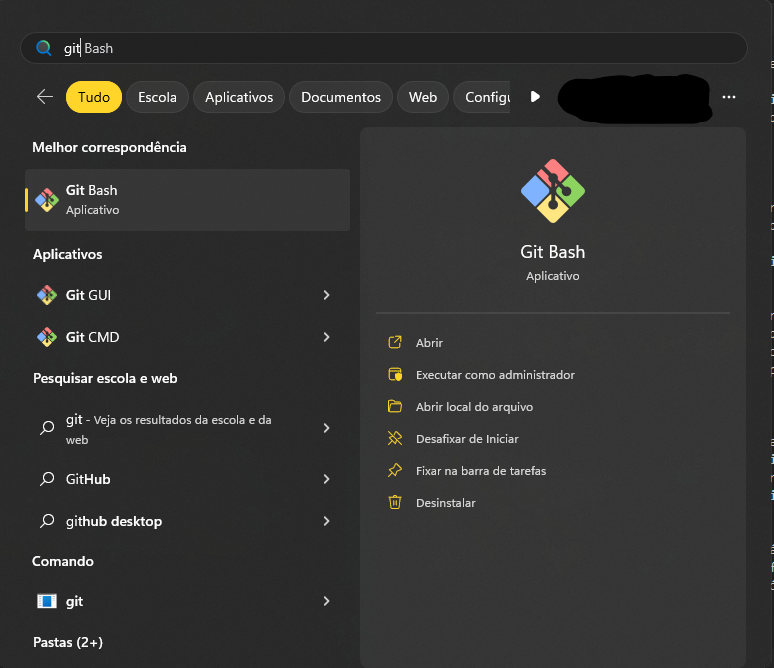

# Primeiros Passos com Git

# Tudo o que você precisa saber sobre Git

Se você acabou de entrar no desenvolvimento de software, com certeza já ouviu (e, talvez, bastante) sobre Git e Github, além de sua importância para a construção de seu portfólio. Porém, para mexer com essas ferramentas, é necessário conhecer o básico das suas utilidades e, afinal, o que significam esses temidos termos.

## O que é Git?

O Git é um controlador de versionamento de código distribuído. Isso significa que o Git serve para controlar as versões de um projeto, monitorar suas alterações e ser utilizado por várias pessoas ao mesmo tempo. 

Já existiam sistemas que faziam “o mesmo”, contudo, o Git se popularizou por ser mais fácil e por ter ajudado no desenvolvimento do Linux - inclusive, o próprio Git foi criado por Linus Torvalds, criador do Linux. 

É necessário instalar o Git para utilizá-lo, e o link está [aqui](https://git-scm.com/).

## E o que é Github?

O Github é um site em que você pode deixar seus repositórios (projetos) que são monitorados pelo Git de forma remota. Também é possível acessar projetos variados (como o próprio algoritmo do Twitter) e perfis de desenvolvedores que contribuem para esses repositórios (como o perfil do próprio Linus). 

Dessa forma, o Github se torna seu portfólio por aparecer os seus projetos de maneira visível, prática e simples. 

Para usufruir do Github, você precisa criar uma conta neste link [aqui](https://github.com/).

Se estiver com dificuldades, recomendo fortemente esse vídeo do meu ex-professor Wellington Cidade [https://youtu.be/FKmw6F7PROE](https://youtu.be/FKmw6F7PROE).

## Agora é mão na massa!

Depois de instalar o Git e criar sua conta no Github, chegou a hora de colocar os conceitos em prática. Bora?

## 1️⃣ Configurar

Antes de realmente praticar, é importantíssmo configurar quem é você para o terminal do Git, mais conhecido como Git Bash. Para acesá-lo, digite na barra de pesquisa do seu computador (no caso do Windows) e pesquise por “Git Bash” ou só “Git” que já aparece.



Agora, no terminal, digite:

```powershell
git config --global user.name <SEU NOME AQUI>
```

Basicamente, você está configurando seu nome globalmente, ou seja, em todos os perfis do computador. Se quiser configurar localmente, use `local` ao invés de `global` .

Por fim, é necessário que você configure seu email. De preferência, utilize o mesmo que foi usado para criar a conta no Github.

```powershell
git config --global user.email <SEU EMAIL AQUI>
```

## 2️⃣ Indo para o “laboratório de testes”

Em terminais, no geral, é possível navegar e criar pastas. Para navegar, utilizamos o comando `cd` . Teste indo para a página “Desktop/” (escrevendo apenas “Desk” e usando o *tab*, ele se autocompleta!) , que é a Área de Trabalho. 


Não se esqueça de dar enter para mandar o comando!

Agora, vamos criar a pasta que será nosso querido laboratório de comandos. Para tal, usaremos o comando `mkdir` para criar a pasta “Lab” (ou o nome que preferir). Depois, é só fazer `cd` para, dessa vez, ir para a pasta criada.


Extra: o comando “dir” exibe as pastas!

Agora, vamos criar um arquivo para manipular. Ele futuramente será monitorado pelo Git. Crie o arquivo `teste.txt` na pasta, no Explorador de Arquivos. 


Agora sim! Que os jogos comecem!

## 3️⃣ Criando o primeiro repositório

No terminal, inicialize o repositório com `git init` , o primeiro comando oficial que você está aprendendo! 


O que podemos observar:

1. Foi criado um repositório vazio, pois ainda não há arquivos monitorados pelo git
2. Surgiu um texto em azul escrito ****main.**** Resumidamente, estamos no ramo principal do repositório, que é criado por padrão e só utilizaremos esse. O conceito de ********branches******** pode ser abordado em outro artigo.

Agora, utilizaremos um outro comando: o `git status`. Ele exibe os arquivos da pasta. Nisso, haverá uma novidade por aí.


Está escrito que o nosso arquivo não está sendo rastreado e que ele está presente na pasta. Algumas outras palavras ainda serão abordadas por aqui, mas, entre parênteses, já está a dica de como adicionar nosso texto para o repositório: o `git add` . Essa adição pode ser feita de duas formas: utilizando o nome do arquivo (no caso, teste.txt) ou colocando o asterisco (*), que adiciona todos os arquivos que ainda não foram rastreados. Neste momento, não fará tanta diferença, pois só há um arquivo.

 


E agora? Nada, aparentemente. Vamos verificar o status do repositório.


O arquivo foi adicionado! Parabéns!

Agora, vamos fazer o ************commit************, também chamado brasileiramente de ******************commitar.****************** Basicamente, vamos “envelopar” esse arquivo para ele ser enviado definitivamente, lá para o Github, lembra? Para empacotar nosso arquivo adicionado, deixamos com ele também uma mensagem, que explica o que foi feito. É importante essa mensagem ter sentido e ser curta. Trata-se de uma espécie de checkpoint, ou “cheguei até aqui, é um ponto importante”. O comando fica mais ou menos assim: 


Agora, chegou a hora de enviar essas alterações. Ou, quase isso. Por quê? Porque nós temos apenas um repositório **********local**********, mas não um **************remoto.************** E é o que faremos agora. 

## 4️⃣ Criando o repositório remoto

Vamos criar agora o repositório remoto, “na nuvem”. Para isso, entraremos no Github e criaremos um repositório.


Selecione este botão “New” no canto superior esquerdo ou em Seu Perfil > Seus Repositórios


Aqui, você coloca o nome do repositório, uma possível descrição e se é público ou privado. Sendo privado, as pessoas não poderão vê-lo quando entrarem no seu perfil.

E agora é hora de linkar as informações. O próprio Github passa a dica do que deverá ser feito: é necessário adicionar esse repositório remoto no local.


## 5️⃣ Linkando as informações

No terminal, rode `git remote` adicionando a origem, que é um link como o do print acima (com .git no final).  Obs: precisa ser o link completo, com o `https://.`

```powershell
git remote add origin <URL.git>
```

E então, se no seu Git Bash já estiver escrito ****main**** ao invés de ******master******, como era antigamente, já é possível enviar, ou melhor ****************empurrar**************** o nosso arquivo de texto.

```powershell
git push  -u origin main
```

O comando empurra os arquivos da ****main**** para a ******origin******, que é o repositório remoto. Sendo assim, basta recarregar a página no Github e veremos a mágica acontecer.


Voilá! A mágica aconteceu. Parabéns! Você criou o seu primeiro repositório. Agora, tente alterar esse arquivo, adicioná-lo, “empacotar” e enviar. Assim, você reforçará os conhecimentos básicos para seguir com projetos pessoais e mais individuais. 

## 6️⃣ Extra, Conclusão e Conteúdos Úteis

Caso você encontre algum repositório interessante ou queira pegar seu repositório em outra máquina, é possível utilizar o comando `git clone` , escrevendo a URL que você pode copiar clicando em “Code”.


Com isso, você aprendeu:

- O que é Git
- O que é Github
- `git init`
- `git status`
- `git add`
- `git commit`
- `git remote`
- `git push`
- `git clone`

Caso algo não tenha ficado muito compreensível ou queira aprender mais sobre, sugiro:

- Vídeos da Rafa Ballerini

[Git e Github](https://www.youtube.com/playlist?list=PLhkO7OMKgT_rqwGYldqcFxyN4yjFgmDh8)

- Curso de Git do Curso em Vídeo (gratuito)

[Git e GitHub [20 Horas] - Curso em Vídeo](https://www.cursoemvideo.com/curso/curso-de-git-e-github/)

Fico à disposição para sanar dúvidas e criar mais conteúdos relacionados.

*Feito por Valentina Corradini Prado.*
