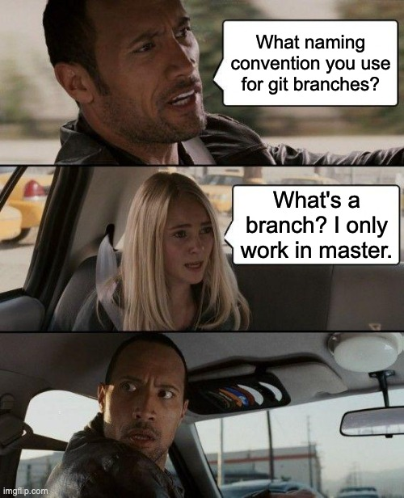

# Branches: como funcionam as ramificações de um projeto

Se você mexe com Git há um tempo, você pode ser uma das pessoas desse meme. E aí, quem você é?

Brincadeiras à parte, se você quer deixar de ser a loirinha do meme e se tornar o The Rock, essa página pode ser o início dessa mudança. Branches são ramificações do seu projeto, sendo a `main` ou a `master` a ramificação padrão e, na maioria das vezes, a principal. Mas afinal, por que criar outras ramificações? Como lidar com esse tipo de situação?

## Motivação por trás

Vamos supor que você esteja trabalhando em um sistema de banco em que só há a branch `main`. Nele, clientes fazem milhares de transações por dia e você foi encarregado de fazer uma manutenção no código. 

Porém, algum erro passa despercebido e pronto: milhares de clientes furiosos sem conseguir realizar transações importantíssimas e provavelmente você perderia seu emprego. Dito isso, **como as branches evitariam essa situação**?

Basicamente, você pode fazer as alterações em uma outra ramificação e, quando tudo estiver pronto, juntar esses dois ramos. Nas próximas páginas, veremos um pouco sobre como as branches são mescladas. O resumo da ópera é: quando você desenvolve em outro ramo, é possível evitar problemas para quem está usando o site ou sistema. Pode ser ainda o caso de uma landing page que apenas exibe um produto, mas se você empurrar para a main, talvez a cor fique errada ou uma imagem fique faltando, o que pode fazer um potencial cliente fechar a aba.

## Comandos

Alguns dos comandos mais utilizados diretamente com branches:

- `git branch`: lista todas as branches criadas
- `git branch NOME`: cria a branch com um NOME
- `git checkout NOME`: vai para a branch NOME
- `git branch -d`: deleta branch
- `git branch -D`: deleta também, mas de forma forçada
- `git checkout -b NOME`:  cria uma branch e automaticamente vai para ela (git checkout + git branch NOME)

## Conclusão

Por meio de Branches, é possível desenvolver features ou resolver bugs de forma isolada, evitando a situação arriscada de gerar alterações que já vão automaticamente para os usuários. Dessa forma, é possível controlar ainda mais o versionamento e criar aplicativos com a codificação sólida e eficiente sem gambiarras na master! 

*Feito por [Valentina Corradini Prado](https://github.com/valencprado).*