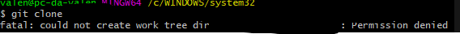

# Copiando repositórios para seu perfil: fork

Talvez você nunca tinha imaginado que iria "garfar" um repositório na sua vida de desenvolvedor. Pois bem, isso existe e não é um comando do Git, mas sim algo exclusivo do GitHub e é fundamental para a ideia colaborativa que o site tem. 

## O que é e por que garfar repositórios?

Vamos supor que um colega seu de faculdade ou curso deixa um repositório que ele estava trabalhando público: um site de dicas de lógica de programação. Você fica extasiado e decide colaborar! 

Nisso, você decide clonar o repositório e se dá com essa mensagem: 

E agora? Você não pode usar o repositório se você não possuir essa permissão. Para isso, é necessário **copiar o repositório** para o seu perfil. Dessa maneira, é possível fazer seus commits e, assim que você tiver feito os commits que desejava, é possível fazer um **pull request**.

Além disso, o fork pode ser uma excelente oportunidade para explorar um repositório que você possua interesse. Por exemplo, é possível forkar o repositório do kernel do Linux para se aprofundar em saber como funciona um sistema operacional. Poderia ser também um bot, um servidor, um aplicativo, entre outros! Basta forkar, clonar o seu repositório no seu computador e "brincar" com tudo que o projeto oferece. É claro, se quiser contribuir ou qualquer coisa do tipo, é recomendada a leitura da licença daquele projeto para compreender quais direitos você possui com aquele projeto. 

## Exemplo prático

Se não ficou muito claro ou gostaria de ver como isso realmente funciona, recomendo assistir esse [vídeo](https://youtu.be/q-QTbNu8Ybc?si=AS9OpDUEKXeP7sxh) do Willian Justen. Ele possui um curso para iniciantes de Git e GitHub que está lá na [página de conteúdos extras](./recommends.md).

## Conclusão

O fork é uma ferramenta-chave do GitHub que irá te tornar um desenvolvedor open-source na plataforma. Por meio dela, é possível adicionar features a repositórios (que desenvolvedores possuem essa permissão de acordo com a licença do projeto) e de estudar afinco um repositório. Desafie-se a encontrar um repositório para garfar ou crie uma segunda conta no Github só para brincar de garfadas!

*Feito por [Valentina Corradini Prado](https://github.com/valencprado).*