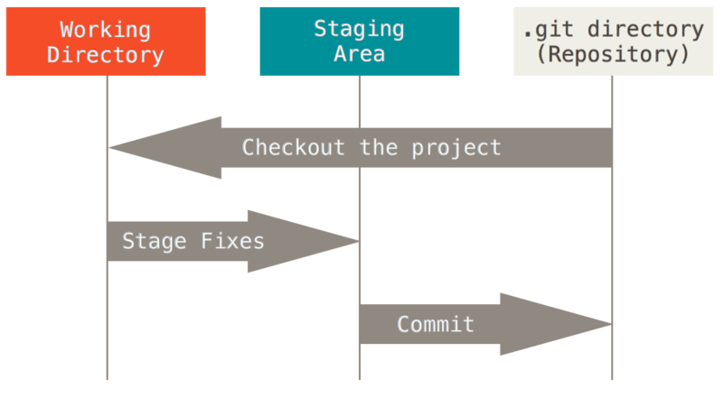

# Outra forma de observar os estágios

Assim como existem aqueles estágios citados, há também os **estados** dos arquivos. Ou seja, são seções onde os arquivos podem estar.

## Working Directory

É a área onde ficam os arquivos com alterações (novas ou simplesmente arquivos novos) não rastreadas. Eles estão esperando para serem adicionados e, dessa forma, seguirem para um commit. Também podem ainda estar sofrendo alterações (afinal, traduzindo livremente, é o diretório de trabalho!).

## Staging Area

Essa é a seção em que constam os arquivos já adicionados, prontos para serem commitados. É uma espécie de "coxia", como se os arquivos estivessem se preparando para entrar em cena".

## Repositório (diretório)

Por fim, quando os arquivos são agrupados em um commit - acompanhado sempre por uma mensagem - eles vão para o repositório local. Assim, podem ser enviados a um repositório remoto, por exemplo. Após os commits, o repositório volta para o estágio inicial e aguarda por novas alterações no projeto. 

## Conclusão

Além dos estágios citados no artigo anterior, os arquivos ficam numa "dança das cadeiras", localizando-se no diretório de trabalho, na área de preparação para o commit e finalmente para o repositório! 

[Fonte da imagem](https://git-scm.com/book/pt-br/v2/Come%C3%A7ando-O-B%C3%A1sico-do-Git#:~:text=O%20Git%20tem%20tr%C3%AAs%20estados%20principais%20que%20seus,fez%20o%20commit%20no%20seu%20banco%20de%20dados.)

*Feito por [Valentina Corradini Prado](https://github.com/valencprado).*
